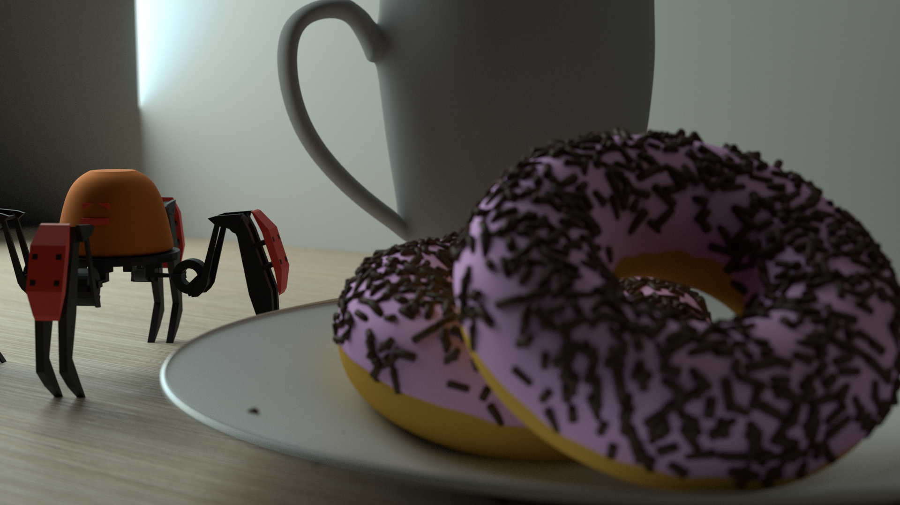

# Tower Defense
> Reinforcement Learning in Game Development

This is an experiment project attempting to incorporate machine learning into game development using [the ML-Agent Library](https://unity.com/products/machine-learning-agents).

The project is not meant for production but rather as an experiment various approach to existing problems, including using reinforcement learning for path-finding and fully procedurally animated enemies. I also learned how to create basic 3D models for prototyping purposes.

This is not meant for commercial use, and it barely works but feel free to experiment with it.

_Some 3D models I created for the game, rendered in blender_
